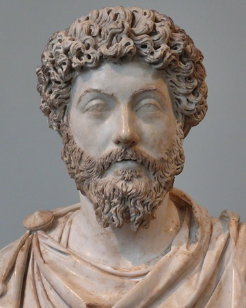
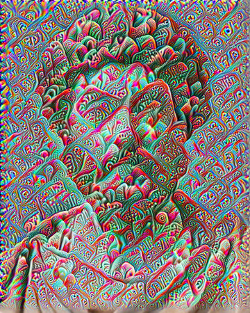
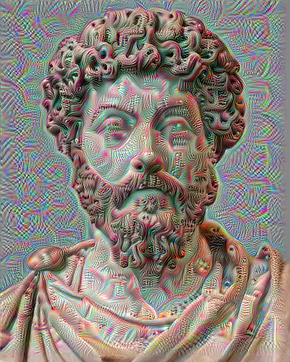

# PyTorch Deep Dream

This is an implementation of Deep Dream in PyTorch.

## Example of usage

```python
import timm
import torch

from deepdreamer import DeepDreamer
from utils import open_image


dream = DeepDreamer(model_name="inception_v3", layers_names=[], "cuda:0)

img = open_image("example_img.jpg")

dream.set_layers(["Mixed_5b"])
dream_img1 = dream.run_deep_dream_with_octaves(img)

dream.set_layers(["Mixed_5c"])
dream_img2 = dream.run_deep_dream_simple(img)
```

Output:

|              Source image               | with `Mixed_5b` layer of InceptionV3 | with `Mixed_5c` layer of InceptionV3 |
| :-------------------------------------: | :----------------------------------: | :----------------------------------: |
|  |     |     |

This code is heavily inspired by [this](https://www.tensorflow.org/tutorials/generative/deepdream) TensorFlow tutorial.
